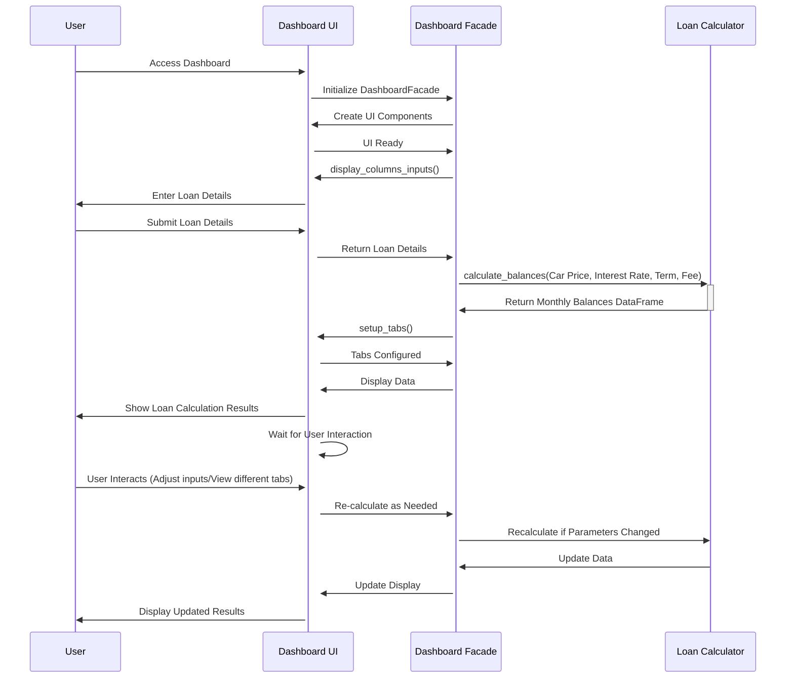

[](https://github.com/arturogonzalezm/car_payments/blob/master/LICENSE)
[](https://github.com/arturogonzalezm/car_payments/actions/workflows/workflow.yml)
[](https://github.com/psf/black)

# Car Loan Payment Dashboard

The Car Loan Payment Dashboard is a Streamlit-based application designed to calculate and visualize car loan payments. It integrates financial calculations with interactive elements to provide users with a detailed understanding of their loan terms, including monthly repayments, interest amounts, principal payments, and overall loan progress.

## Features

- Calculation of monthly car loan payments
- Interactive inputs for car price, interest rate, loan duration, and admin fees
- Visualization of monthly balances and payment breakdowns
- Summary statistics for overall loan payments

## Installation

To run the Car Loan Payment Dashboard, you will need to install Python and several packages. Below are the instructions to set up your environment:

### Prerequisites

- Python 3.8 or higher
- pip

### Dependencies

Install the required packages using pip:

```bash
pip install pandas streamlit plotly
```

### Running the Dashboard

To run the Car Loan Payment Dashboard, use the following command:

```bash
streamlit run app.py
```

The dashboard will open in your default web browser.

## Code Structure

### DashboardFacade
This class serves as the facade for the dashboard, integrating UI components with the loan calculation logic.

- **Methods:**
  - `__init__`: Initializes the UI and calculator components.
  - `setup_dashboard`: Configures the dashboard elements and binds them to Streamlit.

### DashboardUI
Responsible for the creation and management of Streamlit UI components.

- **Methods:**
  - `display_title`: Displays the main title of the dashboard.
  - `display_columns_inputs`: Provides input fields for the user to specify loan details.
  - `setup_tabs`: Configures the tabs for separating different sections of the dashboard.

### LoanCalculator
Handles the financial calculations related to the car loan.

- **Methods:**
  - `calculate_monthly_repayment`: Calculates the monthly repayment amount based on the loan details.
  - `calculate_balances`: Generates a detailed breakdown of payments over the loan period, returning a DataFrame.

## Interaction Sequence Diagram

Below is a sequence diagram illustrating the interaction flow between the user, Dashboard UI, Dashboard Facade, and Loan Calculator components of the Car Loan Payment Dashboard.



## Conclusion
The Car Loan Payment Dashboard is a comprehensive tool for managing and understanding car loan payments. By leveraging Python with Streamlit and Plotly, it provides an interactive and informative platform for users to visualize their loan schedules and financial obligations.


